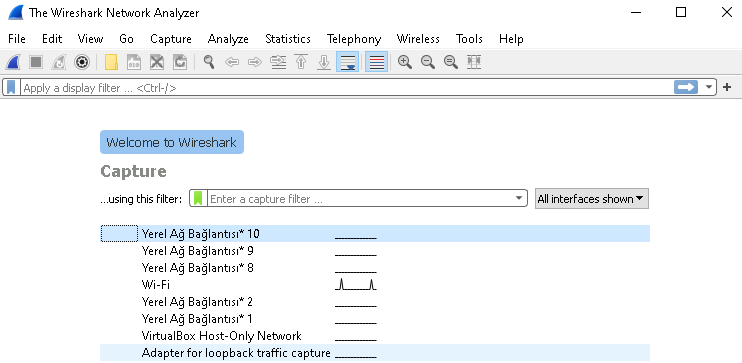
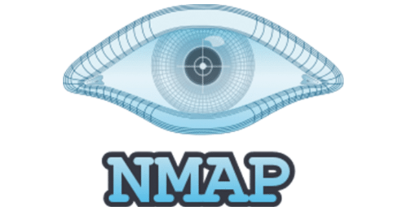
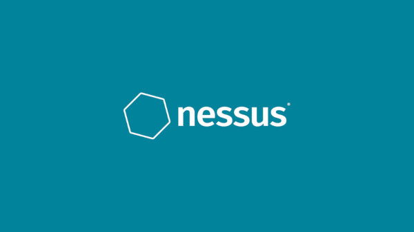
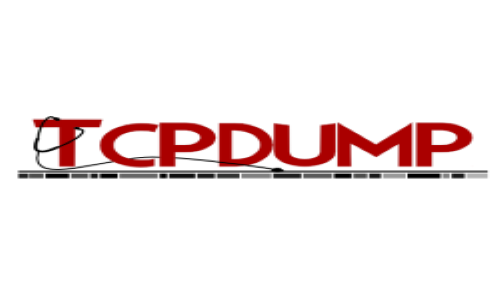
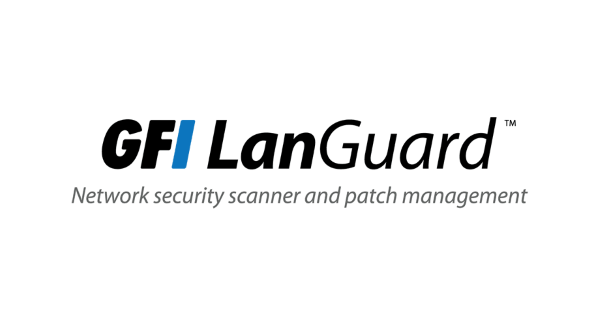
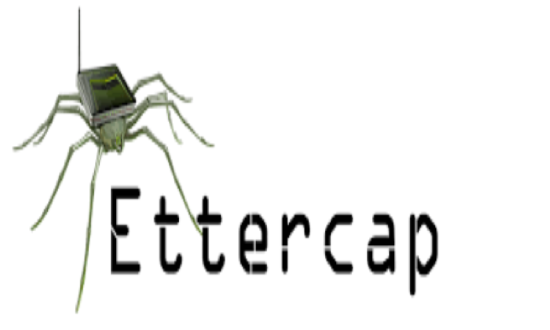

# Güvenlik Araçları

Sizlere blog yazımda temel olarak kullanılan güvenlik araçları hakkında bilgi vermeye çalışacağım. Faydalı olması dileğiyle.

## Wireshark 

1998 yılında  Ethereal adıyla faaliyete başlayan bir proje olarak ortaya çıkmıştır. Daha sonra Wireshark adını almıştır. Wireshark yazılımı bilgisayara ulaşan paketleri yakalayan ve paketlerin içeriğini görüntülemeye imkan sağlayan yazılım olarak geçmektedir. Wireshark programın sağladığı faydalar, güvenlik problemlerini analiz etme, ağ sorunlarını çözme, protokoller üzerinde oluşan hataları tespit etme gibi imkanlar sağlamaktadır.

**Wireshark özellikleri**

- Windows, Unix, OS X, Solaris ve FreeBSD gibi işletim sistemlerini desteklemektedir.
- Ayrıntılı protokol analizi yapmaktadır.
- Kriterlere göre paket arama ve filtreleme yapmaktadır.
- Birçok protokol için şifre çözme desteği sunmaktadır.(IPsec, Kerberos, SSL/TLS vb)

**Wireshark kullanım alanları**

- Ağ trafik tespiti

- Port tarama tespiti

- Casus yazılım tespiti

- Bağlantı sorunu tespiti

- Virüs veya atakların tespitinde kullanılmaktadır.

  

## Nmap

Nmap(Network Mapper) aracı ağ analizlerinde ve sızma testlerinde kullanılan açık kaynaklı ücretsiz araçlar arasında yer almaktadır. Birçok ağ tarama seçeneği sunmaktadır. Nmap sayesinde ağda bulanan bilgisayarların işletim sistemleri, çalıştığı servisleri, açık olan portlar vb birçok konu hakkında bilgiler vermektedir. Linux ve Windows işletim sistemlerinde kullanımı fazladır. Kullanım alanları ise ağ kurulumu sırasında gerekli  testlerin yapılmasında, ağ haritalanmasında ve ağ yönetimde kullanılmaktadır.

## Nessus

Nessus, ücretsiz uzaktan güvenlik taraması yapan araç olarak bilinmektedir. Nessus diğer güvenlik tarama araçlarında önemli bir farkı ise kurallara bağlı olmamasıdır. Örnek olarak 8085  portunda web sunucu çalışsa dahil onu tespit ederek tarama yapmaktadır. Tarama çıktılarını çeşitli formatlarda sunmaktadır.(Html, Xml, ASCI). Uyumlu ek yazılımlarla çalışma imkanı sağlamaktadır. Son olarak Windows ve Unix sistemlerde çalışmaktadır.

## Snort

Gerçek zamanlı trafik analizi ve paket kaydetme yapabilen ücretsiz bir ağ saldırı belirleme sistemidir. Protokol analizi ve içerik eşlemesi  gibi işlevleri bulunmaktadır. Gizli port taramaları, işletim sistemi belirleme saldırılarını önleme imkanı sunmaktadır. Esnek kural yazma imkanı da sağlamaktadır. Aynı şekilde Windows ve Linux işletim sistemlerini desteklemektedir.

## Tcpdump

Tcpdump, ağ inceleme ve veri yakalama amaçlı temel paket analiz aracı olarak bilinmektedir. Linux/Unix sistemlerde çalışmaktadır. Windows sistemlerde  WinDump olarak geçmektedir.

**Özellikleri**

- Metin tabanlıdır.

- Ağ hareketlerini incelemektedir.

- Nmap altyapısını kullanmaktadır.

- Ücretsizdir.

- Paketleri yakalamak için libpcap kütüphanesini kullanılır.

  

  ## GFI LANguard 

Ağda bulunan bilgisayarların içten veya dışarıdan gelebilecek riskleri taramak için kullanılan ücretli araçtır.

**Özellikleri**

- Ağ üzerinde güvenlik açıklarına yönelik tarama yapar.

- Her makinenin servis paket durumunu, yamalanmamış güvenlik açıklarını, açık portlarını, çalışan uygulamalarını vb. birçok bilgiyi raporlama imkanı sunar.

  

## Ettercap

Ettercap, yerel ağlar için kullanılan bir sniffer, araya girme ve kayıt yapma özelliklerine sahip olan güvenlik aracıdır. Linux/Windows işletim sistemlerini desteklemektedir.

**Özellikler**

- Şifreli dahil birçok protokol için aktif ve pasif inceleme özelliği vardır.

- Bağlantılara veri enjeksiyonu yapma ve filtreleme özellikleri vardır.

- İşletim sistemi tespitleri yapma özelliği vardır.

Blog yazımı okuduğunuz için teşekkür ederim.

Öneri ve görüşlerinizi beklerim.

[onurcoskunistanbul@gmail.com](mailto:onurcoskunistanbul@gmail.com)

