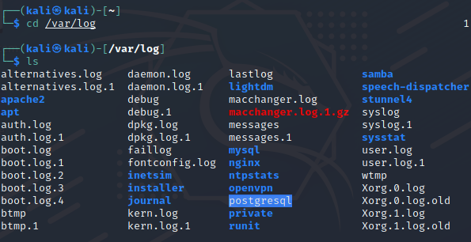
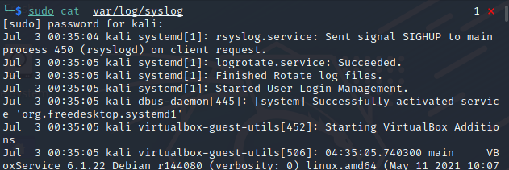
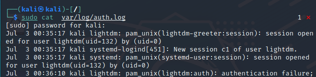
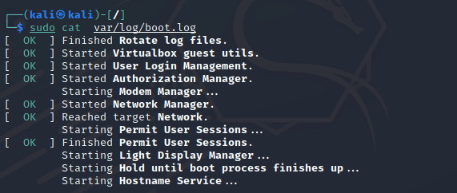
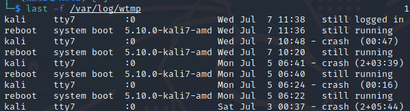

# Linux Sistemlerde Log Dosyaların İncelenmesi

**Herkese Merhabalar,**

Sizlere blog yazımda log nedir, log analizi neden yapılır, log analiz metodolojisi nedir, linux sistemlerde  yer alan log dosyalarını gibi konuları aktarmaya çalışacağım. Faydalı olması dileğiyle.

## Log ve Log Dosyaları Nedir ?

Log kelimesi kayıt anlamına gelmektedir. Log kayıtları aracılığı ile dijital hareketlerin saklanması işlemine log tutma ya da loglama denmektedir.

Log dosyaları genellikle, sistemle veya bunları oluşturan uygulamalarla ilişkili tüm olayları görmek 
için kullanılır. Örneğin, yedekleme programınızda bir problem olduğunda ilgili logları analiz ettiğimizde
probleme ilişkin tespit yapma imkanı sağlamaktadır. Ayrıca sistemin güvenliği içinde log dosyaları önem arz etmektedir. Örnek olarak sisteme kim giriş-çıkış yaptığını incelemek için faydalı olmaktadır.

## Log Analiz Metodolojisi

Log analiz metodolojisini temelde 5 adımda açıklayabiliriz.

Bu adımlar;

- Log dosyalarının elde edilmesi

- Log dosyalarının normalleştirilmesi

- Log analizinin amacını belirlenmesi

- Log analizininde istenen verinin ayıklanması

- Log analizini doğrulama adımıyla sonlanmaktadır.

  

## **Linux Sistem Log Dosyaları**

Linux sistemlerde varsayılan olarak  log dosyaları /var/log dizini altında tutulur. Log dosyalarını incelemek için root konumda olmak gerekmektedir. Bu bölümde temelde olan log dosyalarını inceleyeceğiz.

- ### **/var/log**

**cd /var/log** komutu ile log dosyaların bulunduğu konuma ulaşılmaktadır. Ardından **ls**  komutuyla log dizini içerisinde bulunan tüm log dosyalarını listelenmektedir. Görsel de gördüğünüz gibi sistem içerisinde birtakım log dosyaları bulunmaktadır.

- **/var/log/syslog**

Linux sistem log dosyası /var/log/syslog dosyasında tutulur. Sistemdeki tüm faaliyet verilerini depolar. Syslog sistem hatalarının, saldırıları veya işletim sisteminde oluşan problemler gibi durumları kayıt altında tutar.

**Syslog Error Mesajları**

- **/var/log/auth.log**

Linux işletim sistemlerinde başarısız ssh girişleri ve sistem login girişlerini /var/log/auth.log dosyasının içerisinde bulabilirsiniz. Örnek olması amacıyla herhangi bir kullanıcı sizin sisteminize başarısız ssh girişimlerinde bulunduğu takdirde auth.log dosyası içinde o kullanıcının yaptığı başarısız ssh denemelerini görebilirsiniz. 

-  **/var/log/boot.log**

Linux işletim sistemi boot edilirken oluşan kayıtlar /var/log/boot.log dosyasında tutulur. Önyükleme  ilgili bütün bilgilerin ve  sistem başlatma sırasındaki mesajları depolamaktadır. Bu log dosyası sayesinde oluşan hataları kolayca düzeltme imkanı sağlamaktadır.

- **/var/log/faillog**

Bu log dosyası başarısız oturum açma girişimlerinin barındırır. Kullanıcı adı/parola kırma ve kaba kuvvet saldırılarını tespit etmek için yararlı log dosyasıdır. İçeriğini cat komutu ile görüntüleyebilirsiniz.

**/var/log/wtmp**

Sisteminize en son giriş ve çıkış yapmış olan kullanıcıların, terminal ismi, tarih, saat vb. bilgileri /var/log/wtmp dosyasının içerisinde bulabilirsiniz. Böylece sisteme izinsiz girişler olduğunda bu dosya aracıyla tespit edebilirsiniz.

- **/var/log/secure**

Red Hat ve CentOS tabanlı sistemlerde başarılı ve başarısız oturum açma işlemleri, kimlik doğrulama işlemlerinin kaydını tutan  log dosyasıdır.

**/var/log/maillog**

E-posta sunucularıyla ile ilgili tüm logları depolamaktadır. Posta sunucusunda çalışan hizmetler hakkında bilgi edinebilirsiniz. (postfix, MailScanner, SpamAssassain veya e-posta ile ilgili diğer hizmetler). Posta sunucusu tarafından engellenen olası spam girişimleri hakkında bilgi edinebilirsiniz.

- **/var/log/cron**

Tanımlanan cron işlemlerinin tutulduğu log dosyasıdır. Cron servisinde oluşan hataları rahatlıkla bu log dosyası üzerinden erişebilirsiniz.

- **var/log/kern.log**

Kernel günlüklerini ve uyarı verilerini depolamaktadır. Hızlıca kernel sorunlarını gidermek için önemli rol oynamaktadır. 

Not: Log dosyaları sadece bunlarla sınırlı değildir. Temel olan log dosyalarını sizlere açıklamaya çalıştım.

Blog yazımı okuduğunuz için teşekkür ederim.

Öneri ve görüşlerinizi beklerim.

[onurcoskunistanbul@gmail.com](mailto:onurcoskunistanbul@gmail.com)
