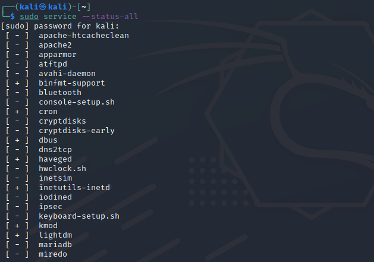

# Linux Sunucuları Üzerinde Gereksiz Servislerin Kapatılması

**Herkese Merhabalar,**

Sizlere blog yazımda Linux sunucuları üzerinde gereksiz servislerin kapatılmasından ve servisler üzerindeki temel komutları aktaracağım. Faydalı olması dileğiyle.

Öncelikle sistemlerde aktif olarak kullanılmayan servisleri kapatmak çoğu kez unutulmaktadır. Ancak bu unutkanlık sistem üzerinde güvenlik açıklarına yol açmaktadır. Ayrıca kullanılmayan servislerin sistem kaynaklarını da tüketmektedir. Bu yüzden servisleri rutin olarak kontrol ederek kapalı olup olmadığını tespit etmek yerinde olacaktır.

Sistemde daha önceden yüklenmiş ancak artık kullanılmayan servisler olabileceği gibi sistem kurulumu sırasında ön tanımlı olarak yüklenen servisler içerisinde gereksiz olabilecek bazı servislerde mevcuttur. Dolayısı ile öncelikli olarak ön tanımlı gelen ve genel olarak kullanılmayan servisleri belirlemek daha doğru olacaktır.

Örnek olarak bluetooth servisi ve cups(print ile alakalı servis) servisi sunucumuzda ihtiyaç yoksa kapatılmalıdır. Önemli bir uyarı kapatılması gereken servisler sunucudan sunucuya değişiklik göstermektedir. Standart kullanıcının sunucusunda kapalı olması gereken bir servis kurumsal bir sunucuda açık durumda olabilir.

## Linux Sunucuları Üzerinde Servislerin Yönetimi

Sunucularda hangi hizmetin kapatılacağına  karar vermek için hangi hizmetlerin çalıştığını görelim, çalıştırılan tüm hizmetleri listeleyelim:

```linux
 systemctl service --status-all
```



**+** olan servisler aktif olduğunu ifade etmektedir.

**-** olan  servisler aktif olmadığını ifade etmektedir.

<hr>

**Servis Yönetimi**

Sizlere cron servisi üzerinden servisler üzerindeki temel işlemleri aktaracağım.

Örnek olarak bir önceki görselde aktif olan cron servisini kapatalım.

```linux
 systemctl disable cron.service
```

komutuyla kapatabiliriz.


<hr>

Pasif olan cron servisi aktif hale getirmek istersek;

```linux
systemctl enable cron.service
```

komutunu kullanmamız yeterlidir.

<hr>

Geçici olarak cron servisini kapatma istersek;

```linux
systemctl stop cron.service
```

komutunu kullanmamız gerekiyor. Fakat sistem yeniden başladığında cron servisimiz otomatik olarak yeniden açılacaktır.

<hr>

Geçici olarak tekrar cron servisini başlatmak istersek;

```linux
systemctl start cron.service
```

komutuyla başlatabiliriz.

<hr>

Cron servisini yeniden başlatmak istersek;

```linux
systemctl restart cron.service
```

komutuyla başlatabiliriz.

<hr>

Cron servisini kesintiye uğratmadan yapılandırma dosyasını yeniden yükleme istersek;

```linux
systemctl reload cron.service
```

komutuyla yeniden yükleyebiliriz.

<hr>

Cron servisinin loglarını görmek istersek;

```linux
journalctl -u cron.service
```

komutuyla görebiliriz.

<hr>

Cron servisinin tüm bilgilerini görüntülemek istersek;

```linux
systemctl show cron.service
```

komutuyla görüntüleyebiliriz.

<hr>

son olarak aktif ve pasif olan servisleri listelemek istersek;

```linux
systemctl list-units --type service
```

kullanmak yeterlidir.

<hr>

Not: Bazı Linux dağıtımlarında  komut değişiklikleri olmaktadır.

Özetle,

Blog yazımda herhangi bir servisi nasıl kapatabiliriz, neden kapatmamız gerekiyor, servislerin yönetiminde hangi temel komutlar kullanılır gibi konuları sizlere açıklamaya çalıştım. Kapalı kalması öngörülen bazı servislerin listesine https://blog.cliaweb.com/linux-gereksiz-servislerin-kapatilmasi.html 'den ulaşabilirsiniz.

<hr>


Blog yazımı okuduğunuz için teşekkür ederim.

Öneri ve görüşlerinizi beklerim.

[onurcoskunistanbul@gmail.com](mailto:onurcoskunistanbul@gmail.com)

