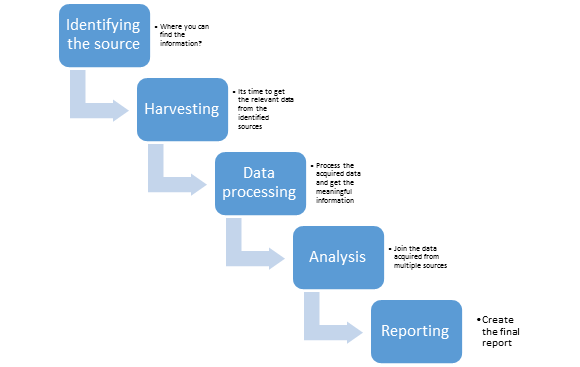

**Herkese Merhabalar,**

Sizlere blog yazımda osint nedir, osint metedolojisi, osint ile bilgi toplama ve osint için kullanılan araçlar gibi konulardan bahsedeceğim. Umarım sizler için faydalı bir yazı olur.

# Open-Source Intelligence (OSINT) Nedir?

Osint, açık kaynak istihbaratı olarak geçmektedir. Osint halka açık kaynaklardan(sosyal medya, forumlar, bloglar vb) verileri toplamak, analiz etmek ve veriler üzerinde karar verme gibi işlemlerin yapıldığı bir metodoloji olarak ifade edebiliriz. Osint, aktif bilgi toplamaya geçmeden pasif bilgi toplama işlemdir. Yani karşı taraf ile temasa geçmeden bilgi edinme anlamına gelmektedir. 

Osint sayesinde kurum veya kişiler hakkında birçok veriye ücretsiz bir şekilde ulaşılabiliriz. Osint metodolojisini 1980’li yıllarda daha çok askeri istihbarat için kullanılmıştır. Günümüzde ise siber güvenlik alanında çalışan bireyler daha çok kullanmaktadır. Osint sayesinde hedefle ilgili sosyal medya hesabı, dns kayıtları, Ip adres tespiti, subdomainlerin bulunması gibi konularda kolaylık sağlamaktadır. Osint'in tercih edilme sebepleri başta  ücretsiz olarak birçok bilgiye ulaşabilme, yasal konuda herhangi bir sıkıntı oluşturmaması, erişebilirliğin kolay olması gibi avantajları bulunmaktadır.
  

## Osint Metedolojisi

Kaynakların Tanımlanması(**Source Identification)**: Open Source Intelligence’nin ilk aşamasıdır. Bu aşamada kurum veya kişiler ile ilgili olası bütün bilgileri ve kaynakların belirlenmesi yer almaktadır.

Veri Toplama(**Data Harvesting**): Veri toplama aşamasında ise belirlenen kurum veya kişiler için ilgili bütün bilgiler toplanmaktadır.

Veri İşleme ve Sıralandırma(**Data Processing and Integration**): Toplanan verilerin önem sırasına göre işleme ve sıralanması yapılmaktadır.

Veri Analizi(**Data Analysis**): Veri analizi aşamasında ise  toplanan verileri  çeşitli  Osint araçları kullanılarak analiz ve doğruluğu yapılmaktadır.

Raporlama(**Reporting**): Osint için son aşama ise analiz edilen verileri raporlanmaktadır.

## Osint İle Bilgi Toplama

### Arama Motorları ile Bilgi Toplama

Arama motorlarında doğru teknikler sayesinde hızlı ve etkili birçok veriye ulaşılmaktadır. Örnek olarak Google Dork terimlerini kullanarak aramakta olduğumuz veriye daha hızlı ulaşabiliriz.

**Bazı dork terimleri;**

**Intitle:** Belirtilen anahtar kelimeyi uyumlu başlıklarda aramaktadır.

**Inurl:** Belirtilen anahtar kelimeyi url linki içinde aramaktadır.

**Intext:** Belirtilen anahtar kelimeyi metin için aramaktadır.

**Insubject:** Belirtilen anahtar kelimede içeriği kısıtlamaya yaramaktadır.

### Dark ve Deep Web ile Veri Toplama

Dark ve Deep Web sıradan arama motorları dışındaki verileri barından alanlardır. Ancak Dark Web diğerlerine göre daha az alana ve farklı amaçlara hitap etmektedir. Yani yasal olmayan birçok faaliyetler yapılmaktadır. Bu yüzünde dikkatli olmak gerekir. Dark Web ve  Deep Web’e farklı araçlarla ulaşılmaktadır.

### İş Siteleri Üzerinden Veri Toplama

Linkedln, Glassdoor vb iş arama siteleri üzerinden bırakılan bilgiler sayesinde  birçok kişinin kişisel bilgisine ulaşılmaktadır. Bu yüzden bu tarz siteler üzerinden verdiğimiz kişisel bilgiler için dikkatli olmakta yarar var.

### Sosyal Ağ ile Veri Toplama

Günümüzde onlarca sosyal ağ siteleri bulunmaktadır. Sosyal ağ üzerinden birçok kişisel bilgiler verilmektedir. Birtakım kötü niyetli kişiler bu bilgileri elde ederek kişilere sosyal mühendislik saldırıları düzenlemektedir. Verdiğimiz kişisel bilgileri gözden geçirmek önem arz etmektedir.

Osint için bilgi toplama alanları sadece bunlarla kısıtlı değildir. Web arşivlerinden, whois sorgularından, meta verilerinden bilgiler elde edilmektedir.

## Osint İçin Kullanılan Araçlar

Osint için birçok araç bulunmaktadır. Bunlardan bazılarını sizlere aktaracağım. Daha fazla araç hakkında bilgi elde etmek için Osint Framework sitesini ziyaret edebilirsiniz (https://osintframework.com/).

**Shodan**

Shodan ile; modem ara yüzlerine, yazıcılara, kamera sistemlerine ve serverlara kadar erişim sağlanabilir. Bu nedenle oldukça etkili bir araçtır. Shodan , filtreler kullanarak çeşitli bilgisayar tabanlı sistemleri (desktop, switch, router, servers vb.) bulmayı sağlayan bir arama motorudur. Arama motoru olmasına rağmen, Google, Yahoo veya Bing gibi arama motorlarından çok farklıdır. Shodan, tarama yaptığı ip adreslerinin port numaralarını sorgulayarak aldığı yanıtlara göre çalışan servisleri tespit etmektedir. Osint açısında çok faydalı bir araçtır.

**Hunter.io**

Hunter.io ile e-postaları ifşa olan kurum veya kişilerin e-postalarına erişim sağlanmaktadır. İfşa olan e– postalar ile kurum ve kişilere sosyal mühendislik saldırıları yapılmaktadır.

**Wayback Machine**

Internet üzerinde indexlenen web sitelerine ait geçmiş bilgilerin elde edilmesini sağlayan bir web aracıdır. 

**Exif Regex**

Exif Regex aracının en sık kullanım alanlarından birisi de fotoğraf/resim analizidir. Çekilen bir fotoğrafın çekildiği yerleşke bilgisi (eğer GPS özelliği açıldıysa ve bir takım ayarlar etkinse) ,dosyanın oluşma tarihi, hangi cihaz ile çekildiği gibi bir takım bilgiler elde edilebilir.

**Socialcatfish** 

Socailcatfish aracı verilen  kullanıcı adına göre bizlere yaş, aktif sosyal medya bilgileri, email, telefon bilgilerini vermektedir. Bu aracı bir güzel  özelliği ise sizlere ülke ve yaş bazında arama olanağa vererek arama alanınızı daraltarak doğru hedefi bulmamızı sağlamaktadır. Ve bu bilgileri sizlere rapor halinde sunmaktadır.

**Foca**

Hedef  taramalar  sırasında meta verilerini ve gizli bilgileri bulmak için kullanılan açık kaynaklı araçtır. Google, Bing ve DuckDuckGo gibi arama motorundan elde edilen bilgileri sunmaktadır. URL aracılığıyla keşfedilen bilgilerin eksiksiz bir analizi, dosyayı indirmeden önce bile göstermektedir.

**Maltego**

Paterva tarafında Java ile geliştirilen, açık kaynaklı bilgi toplama aracıdır. Bu araç için hızlı bir şekilde hedef için verileri bir arada bulabiliyoruz. Araç  sayesinde alan adları, whois bilgisi, e-posta adresi, telefon, sosyal ağ paylaşımları, kişisel bilgileri ve Ip adresleri vb ögeleri bulmaktayız. Aracın ücretsiz ve ücretli sürümleri bulunmaktadır.

**Pastebin**

Pastebin aracı sayesinde kurum veya kişilerin  paylaşılan veya ifşa edilen herhangi bilgiyi elde etme olanağı sağlamaktadır. Örnek olarak e-posta hesap bilgileri ve parolaları verebiliriz.

**Pipl**

Pipl aracı üzerinden kurum veya kişiler için önemli bilgiler elde edilmektedir. Örnek olarak ise sosyal medya adresleri, iletişim bilgileri, ev adresleri gibi bilgiler elde edilmektedir.

 **Iplocation.com**

IP adresinin lokasyonu öğrenmek için kullanılan ücretsiz araçlardan bir tanesidir.

**ViewDns**

ViewDNS.info, 20 farklı  kaynaktan bilgileri getirmektedir. Ayrıca, IP konum bulma, IP traceroute, MAC adres arama ve daha fazlası gibi çeşitli yararlı araçları da yanında getirir. Çok geniş kapsamlı analiz yapmaya yarayan bilgileri getirmektedir. Örnek olarak hedef domain adıyla o domaine ait e-posta-cep telefonu, alan alanı ne zaman alındı, ne zaman bitecek gibi konularda bilgi vermektedir.

**Namecheck**

Aracın ana amacı bulmak istediğiniz kullanıcı adına ait sosyal ağ ve web sitelerinde mevcut olup olmadığını belirlemek ancak bilgi toplama aşamasında bize pek çok kaynaktan tek seferde bilgi verdiği için kullanışlı osint araçları arasındadır.

**DnsDumpster**

Bu araç ilgili domaine ait subdomainleri, dns kayıtları vb konularda bilgi edinmemizi sağlayan araçtır.

Blog yazımı okuduğunuz için teşekkür ederim.

Öneri ve görüşlerinizi beklerim.

onurcoskunistanbul@gmail.com
