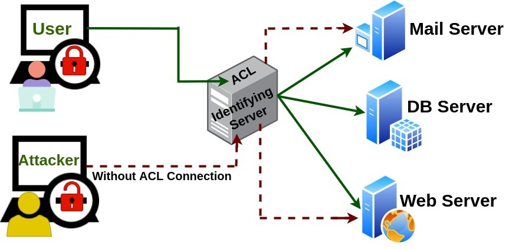

**Herkese Merhabalar,**

Sizlere blog yazımda OWASP TOP 10 web güvenlik açıklıklarından broken authentication ve broken access controlu aktaracağım. Faydalı olması dileğiyle.

# Broken Authentication Nedir ?

Broken Authentication açıklıkları genellikle  kimlik doğrulama yada oturum yönetimi ile ilgili fonksiyonların yanlış yapılandırılması sonucunda ortaya çıkan web açıklık türüdür. 

Broken Authentication açıklığını daha iyi anlamak için örnek senoryaları listelemek daha iyi olacaktır.

Bu senaryolar;

- Kimlik doğrulaması bulunmayan API noktaları

- Parola kurtarma için oluşturulan anahtar değerinin tahmin edilebilir olması

- GET parametresi ile alınan kimlik bilgileri gibi senaryolar bu açıklığa neden olmaktadır.

## Broken Authentication Önlemleri

Broken Authentication için alınabilecek bazı önlemler;

- Yanlış login giriş sınırı getirilmesi

- Yanlış giriş denemelerinin log kayıtlarının incelenmesi

- Güçlü parolaların oluşturulması

- Çok faktörlü kimlik doğrulamanın yapılması

  

  

# Broken Access Control Nedir ?

Broken Access Control açıklığı  web uygulamalarında kullanıcı yetkilerinin doğru yapılandırılmamasından kaynaklı ortaya çıkan web açıklık türüdür. Broken Access Control açıklığından dolayı yetkisiz dosya erişimi, yetkisiz fonksiyon kullanımı, yetkisiz bilgilere erişim ve değişimi gibi sorunlara neden olmaktadır.

Örnek senoryalar ise;

- API’ye Yetkisiz Erişim

- Diğer Kullanıcıların Bilgilerini Görüntüleme

  

  Aşağıda verilen örnekte ali değeri yerine farklı bir değer yazıldığında o kişiye ait hesaba erişme olanağı veriyorsa burada Broken Access Control açıklığından bahsedebiliriz.

 .com/kullanici.php?**kull=ali**

 .com/kullanici.php?**kull=mehmet**

## Broken Access Control Önlemleri

- Server directory listing özelliğinin kapalı olması

- JWT tokenleri, oturum sonrası gereksiz kılma açıklık için alınacak önlemler arasındadır.

  

  

  Blog yazımı okuduğunuz için teşekkür ederim.

  Öneri ve görüşlerinizi beklerim.

  [onurcoskunistanbul@gmail.com](mailto:onurcoskunistanbul@gmail.com)

  
